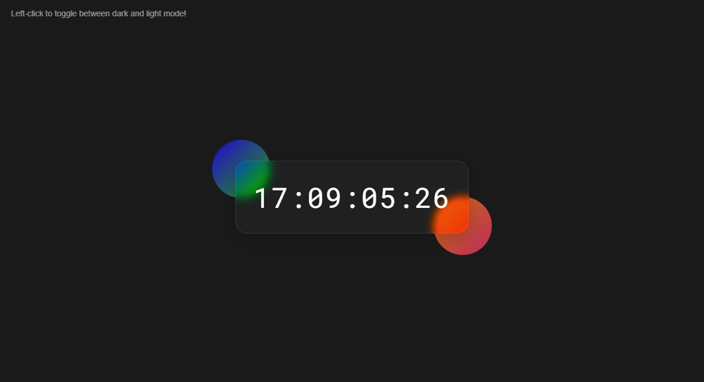

# Glassmorphism Digital Clock

This project is a digital clock designed with a glassmorphism style. I created this project to learn and explore the glassmorphism design trend, which combines frosted-glass effects with smooth gradients and subtle shadows.

## Features

- Real-time digital clock
- Glassmorphism design elements
- Responsive layout
- **Switch between dark mode and light mode with a left-click**

## Technologies Used

- HTML
- CSS
- JavaScript

## How to Switch Between Modes

You can toggle between **dark mode** and **light mode** by clicking anywhere on the clock with the left mouse button. The clock starts in dark mode by default.

## How to Run

1. Clone the repository
2. Open `index.html` in your browser